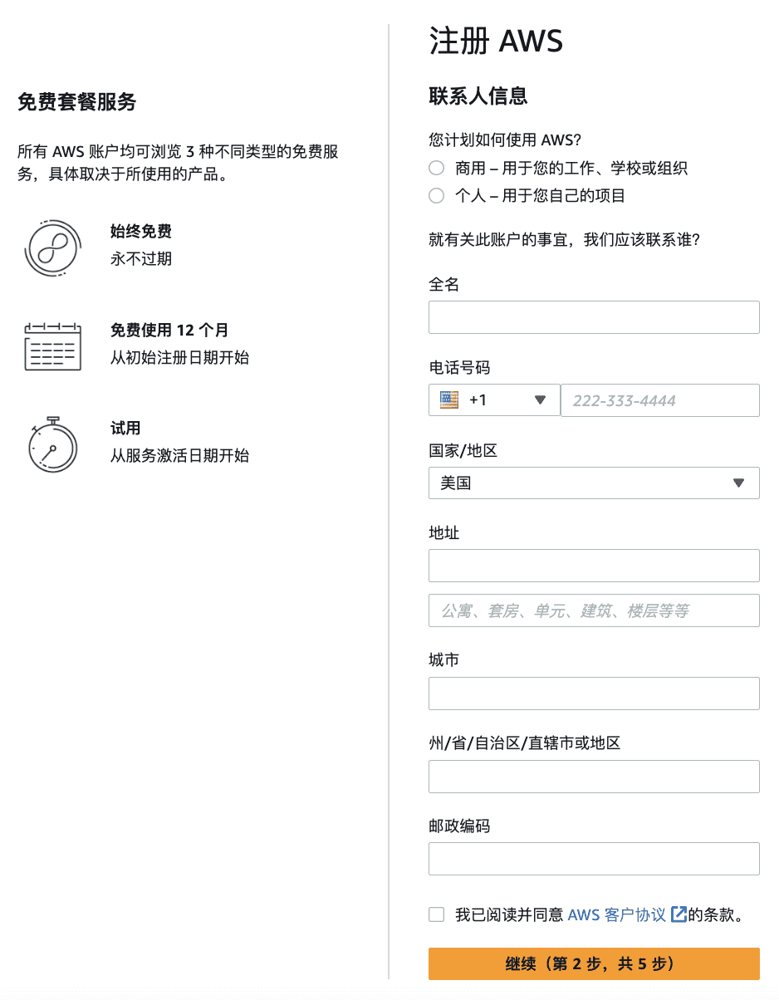
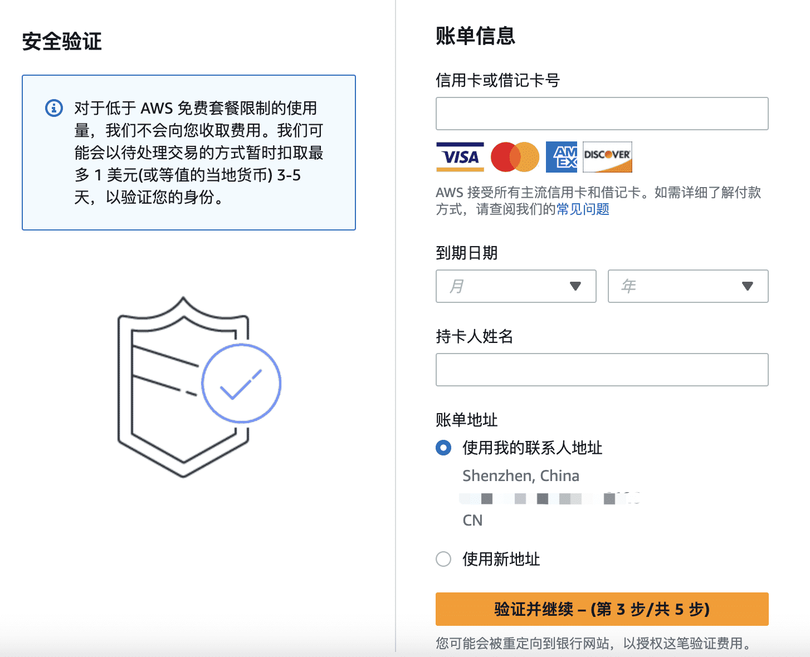
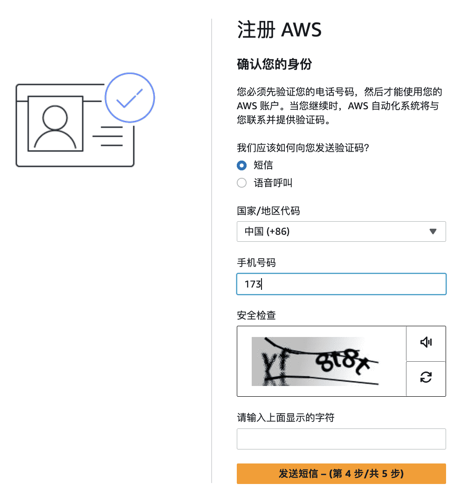
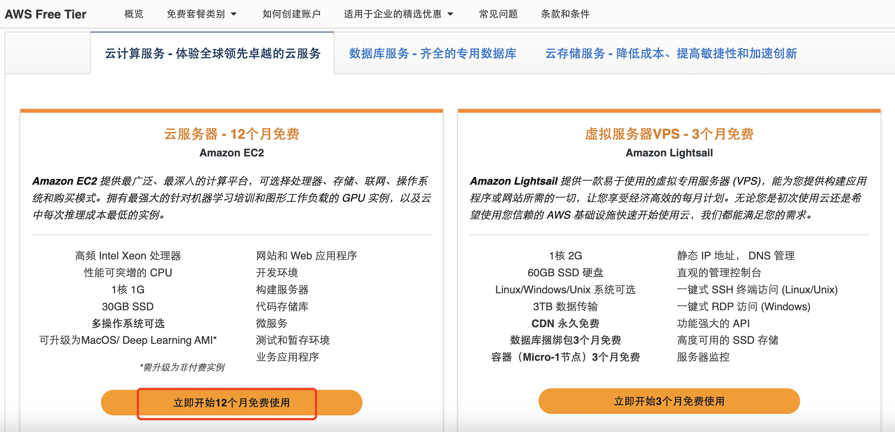
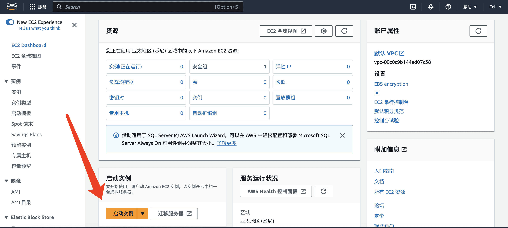
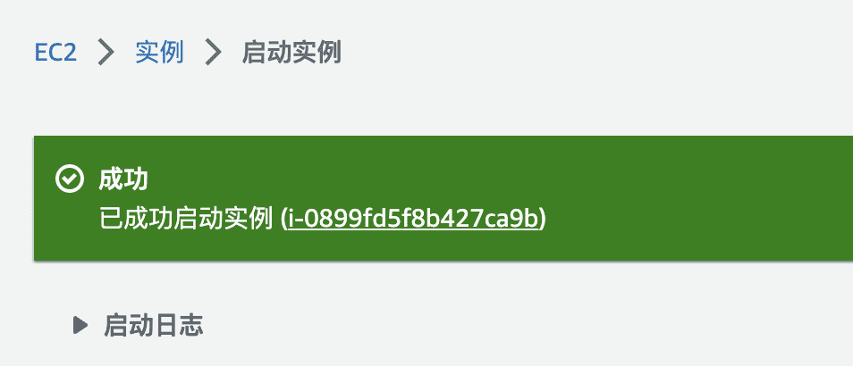

# 将 Hugo 博客部署到亚马逊云服务器


本文将介绍如何将 Hugo 博客打包并部署到亚马逊云服务器上，并附上亚马逊云服务器的配置过程。

## 前言

最近很长一段时间都是使用 Hugo 在写博客，也花了很多精力在 [hugo-fixit](https://github.com/hugo-fixit/FixIt) 这个主题的开发上。也听到很多使用 Hugo 写博客的网友们问我，如何部署博客？部署到哪里？

今天就介绍一种方式：**把博客部署到云服务器上**。

但是国内的云服务器太贵了，而且还要备案，所以就想到了海外的云服务器，比如亚马逊云服务器，以下便是注册到部署的全过程。

<!--more-->

## 注册亚马逊云账户

打开 [亚马逊账号注册地址](https://aws.amazon.com/cn/free/?sc_channel=seo&sc_campaign=blog0805)，点击右上角创建 AWS 账户。


1. 填写邮件地址和账号名称（支持使用国内的邮箱）
   
2. 验证邮件
   
3. 输入密码
   
4. 联系人信息
   
5. 付款信息（Visa）
   
6. 验证手机号（支持中国地区国内手机号）
   
7. 选择支持计划
   
8. 完成注册
   
9. 登录亚马逊云控制台，[登录地址](https://console.aws.amazon.com/console/home)，选择根用户输入电子邮件地址，点击下一步会让输入密码，输入密码后就可以完成登录了。

## 创建 EC2 服务实例

点击链接查看 [亚马逊免费套餐](https://aws.amazon.com/cn/free/?sc_channel=seo&sc_campaign=blog0805)，找到云服务器 EC2，点击立即开始 12 个月免费使用。



进行 EC2 服务器主页后，点击页面**创建实例**按钮。



然后按照页面提示要求，依次填写或选择：

1. 实例的名称：随便填
2. 应用程序和操作系统映像 (Amazon Machine Image)：Amazon Linux 和 Amazon Linux 2023 AMI 免费套餐
3. 实例类型：选择免费套餐
4. 密钥对（登录）：这里要点击创建密钥对，输入密钥对名称，选择 RSA 点击创建密钥对会下载文件到本地，要妥善保存，登录时会用到
5. 网络设置：安全组把允许来自于 http 和 https 得都勾选上
6. 配置存储：默认是 8G，但免费的最多可以 30G，可以手动改成 30G
7. 然后点击右侧侧边栏启动实例，等待片刻实例就创建好了

## 连接实例



点击上面的实例 ID 进入实例的详情，再点击右上角的连接按钮。


连接成功后，页面会新打开一个窗口，这个窗口就是我们服务器的终端，可以在这里对服务器进行操作。


## 创建 root 用户角色

在终端中输入以下命令，创建 root 用户角色。

```bash
# 切换到 root 用户
sudo -i

# 修改 sshd 配置文件
vi /etc/ssh/sshd_config
```

修改如下两项

```text
PermitRootLogin yes
PasswordAuthentication yes
```

设置 root 用户密码

```bash
passwd
```

会让输入两次密码，输入完成，重启一下 ssh 服务：

```bash
service sshd restart
```

重启后在电脑命令行就可以通过 ssh 协议加上用户名称+密码连接远程服务器了。

```bash
ssh root@3.85.xxx.xxx
```

> 后续操作尽量用 root 用户进行。

## 安装宝塔面板

宝塔面板是一个服务器管理面板，可以通过宝塔面板来管理服务器，比如安装 nginx、mysql、php 等等。

```bash
yum install -y wget && wget -O install.sh https://download.bt.cn/install/install_6.0.sh && sh install.sh ed8484bec
```

1. 在亚马逊服务器实例安全组中放行 TCP `19430` 端口
2. 宝塔面板安装完后按照命令行提示打开宝塔面板，进入面板安装 `LAMP` 环境，其中包含了我们需要的 `nginx`
3. 等待 `LAMP` 环境安装完毕

## 部署 Hugo 博客

Hugo 博客打包

```bash
hugo -v --gc --minify
```

将打包好的 `public` 文件夹上传到服务器的 `/www/wwwroot/hugo` 目录下，输入以下命令，等待上传完成。

```bash
# 上传文件（需要输入 root 用户密码）
scp -r /path/to/public root@3.85.xxx.xxx:/www/wwwroot/hugo
```

在宝塔面板中选择网站，点击添加站点：

1. 域名：填写你的公网 IP 或者域名
2. 网站目录：选择 `/www/wwwroot/hugo`
3. 站点备注：随便填
4. FTP、数据库选择不创建，PHP 选择纯静态
5. 点击提交

在浏览器中输入服务器的公网 IP 地址，就可以看到 Hugo 博客了。


## 注意事项

> 亚马逊的服务器每个月免费时长时 **750** 小时，一个月 31 天 x 24 = 744 小时，正常使用是不会超出免费的份额的，但切记不要同时开两个服务器实例，使用时长会累加，不注意可能会超出套餐额度。
>
> 到期后，如果不想继续使用，一定要记得删除实例，不然会一直扣费的。在控制台选中实例，点击实例状态->终止实例。

## 总结

有了一台海外服务器，我们还可以做很多事情，比如部署 chatgpt 等等，有了服务器一定要多去探索和学习，这么复杂的申请的流程，不要白白放着让过期了。

保持探索欲，砥砺前行！


---

> 作者: [Lruihao](https://github.com/Lruihao)  
> URL: https://lruihao.cn/posts/aws-ec2/  

