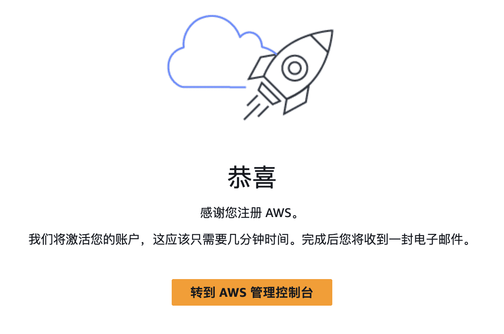

# 尝试在 Python 中使用 Amazon Titan 文本模型

&lt;!-- markdownlint-disable-file no-duplicate-heading--&gt;

本文将通过 Python 代码探索 Amazon Titan 文本模型系列（包括 Express、Lite 和 Embedding）。

&lt;!--more--&gt;

## 认识 Amazon Titan

[Amazon Titan](https://aws.amazon.com/cn/bedrock/titan/) 是来自亚马逊云科技的高性能基础模型。[Amazon Bedrock](https://aws.amazon.com/cn/bedrock/) 独有的 Amazon Titan 系列模型融合了 Amazon 25 年来，在其业务范围内积累的人工智能和机器学习创新的经验。Amazon Titan 基础模型（FM）通过完全托管的 API 为客户提供广泛的高性能图像、多模式和文本模型选择。Amazon Titan 模型由 AWS 创建并在大型数据集上进行预训练，使其成为强大的通用模型，旨在支持各种用例，同时还支持负责任地使用 AI。你可以按原样使用，也可以根据自己的数据私下进行自定义。

Amazon Titan 文本模型系列包括：

- Titan Text Express
- Titan Text Lite
- Titan Text Embeddings
- Titan 多模态嵌入
- Titan Image Generator（预览版）

本文主要探索 Express、Lite 和 Embeddings。更多细节和其他模型请访问 [Amazon Titan 文本模型系列](https://aws.amazon.com/cn/bedrock/titan/)。

如果你还没有注册亚马逊云科技账户，可以参考本文最后一节 [注册亚马逊云科技账户](#register-aws)。

## 环境准备

我正在使用配置了 AWS Credential 的 vscode 本地环境。

### 安装最新的 Python

```bash
python --version
# Python 3.11.5
```

### 升级 pip

```bash
pip install --upgrade pip
```

### 安装依赖

```bash
pip install --no-build-isolation --force-reinstall \
    &#34;boto3&gt;=1.33.6&#34; \
    &#34;awscli&gt;=1.31.6&#34; \
    &#34;botocore&gt;=1.33.6&#34;
```

### 加载库

```py
import json
import os
import sys

import boto3
import botocore

bedrock = boto3.client(service_name=&#34;bedrock&#34;)
bedrock_runtime = boto3.client(service_name=&#34;bedrock-runtime&#34;)
```

## Titan 文本模型 - Express {#express}

### 设置 Prompt

```py
# 写一个关于 AWS Lambda 的文章
express_prompt = &#34;write article about AWS Lambda&#34;
```

### 配置模型

```py
body = json.dumps({
    &#34;inputText&#34;: express_prompt, 
    &#34;textGenerationConfig&#34;: {  
        &#34;maxTokenCount&#34;: 128,
        &#34;stopSequences&#34;: [], # 定义指示模型结束文本生成的短语
        &#34;temperature&#34;: 0, # 温度控制随机性；较高的值会增加多样性，较低的值会提高可预测性
        &#34;topP&#34;: 0.9 # Top P 是一种文本生成技术，从分布中最可能的标记中采样
    }
})
```

### 调用模型

```py
response = bedrock_runtime.invoke_model(
    body=body,
    modelId=&#34;amazon.titan-text-express-v1&#34;,
    accept=&#34;application/json&#34;, 
    contentType=&#34;application/json&#34;
)
```

### 解析配置

```py
response_body = json.loads(response.get(&#39;body&#39;).read())
outputText = response_body.get(&#39;results&#39;)[0].get(&#39;outputText&#39;)

# 代码 text = outputText[outputText.index(&#39;\n&#39;)&#43;1:] 提取 outputText 字符串中第一个换行符后面的子字符串。这对于第一个换行符之前的初始内容不相关并且您想要捕获其后面的文本的情况非常有用。index(&#39;\n&#39;)&#43;1 定位第一个换行符的位置，切片 [index&#43;1:] 取出后续文本，将其赋值给变量 text
text = outputText[outputText.index(&#39;\n&#39;)&#43;1:]
about_lambda = text.strip()
print(about_lambda)
```

### 运行结果

```plain
AWS Lambda is a serverless computing service provided by Amazon Web Services (AWS). It allows developers to run code in response to events without the need to manage any infrastructure. In this article, we will explore the features and benefits of AWS Lambda, as well as how to use it to build serverless applications.

Features and Benefits of AWS Lambda:

Serverless Computing: AWS Lambda is a serverless computing service, which means that developers do not have to worry about managing servers, operating systems, or infrastructure. Lambda runs the code in an environment that is managed by AWS, and scales automatically based
```

## Titan 文本模型 - Lite {#lite}

### 设置 Prompt

```py
# AWS DynamoDB 和 AWS Redis 两个 AWS 服务的区别
lite_prompt = &#34;2 difference between AWS DynamoDB and AWS Redis&#34;
```

### 配置模型

```py
body = json.dumps({
    &#34;inputText&#34;: lite_prompt, 
    &#34;textGenerationConfig&#34;: {  
        &#34;maxTokenCount&#34;: 128,
        &#34;stopSequences&#34;: [], # 定义指示模型结束文本生成的短语
        &#34;temperature&#34;: 0, # 温度控制随机性；较高的值会增加多样性，较低的值会提高可预测性
        &#34;topP&#34;: 0.9 # Top P 是一种文本生成技术，从分布中最可能的标记中采样
    }
})
```

### 调用模型

```py
response = bedrock_runtime.invoke_model(
    body=body,
    modelId=&#34;amazon.titan-text-lite-v1&#34;,
    accept=&#34;application/json&#34;, 
    contentType=&#34;application/json&#34;
)
```

### 解析配置

```py
response_body = json.loads(response.get(&#39;body&#39;).read())
outputText = response_body.get(&#39;results&#39;)[0].get(&#39;outputText&#39;)
text = outputText[outputText.index(&#39;\n&#39;)&#43;1:]
compare_dynamodb_redis = text.strip()
print(compare_dynamodb_redis)
```

### 运行结果

```plain
Amazon DynamoDB is a fully managed NoSQL database service in the cloud that offers fast and predictable performance with seamless scalability. It is designed to run high-performance applications at any scale. On the other hand, Amazon Redis is a fully managed in-memory data structure store that provides real-time analytics, caching, and key-value data storage. It is suitable for applications that require fast data retrieval and low latency.
```

## Titan 文本模型 - Embeddings {#embeddings}

### 设置 Prompt

```py
# AWS re:Invent 2023 是我们今年最大的云活动，在内华达州拉斯维加斯举行，包括主题演讲、创新讲座、构建者实验室、研讨会、技术和可持续发展演示
embed_prompt = &#34;AWS re:Invent 2023, our biggest cloud event of the year, in Las Vegas, Nevada, featured keynotes, innovation talks, builder labs, workshops, tech and sustainability demos&#34;
```

### 配置模型

```py
body = json.dumps({
    &#34;inputText&#34;: embed_prompt, 
})
```

### 调用模型

```py
response = bedrock_runtime.invoke_model(
    body=body,
    modelId=&#34;amazon.titan-embed-text-v1&#34;,
    accept=&#34;application/json&#34;, 
    contentType=&#34;application/json&#34;
)
```

### 解析配置

```py
response_body = json.loads(response.get(&#34;body&#34;).read())
embedding_output = response_body.get(&#34;embedding&#34;)

# 此代码从响应正文中检索“嵌入”向量，并打印其长度以及前三个和最后三个值的预览，显示嵌入向量的片段
print(f&#34;You can find the Embedding Vector {len(embedding_output)} values\n{embedding_output[0:3]&#43;[&#39;...&#39;]&#43;embedding_output[-3:]}&#34;)
```

### 运行结果

```plain
You can find the Embedding Vector 1536 values
[0.40429688, -0.38085938, 0.19726562, &#39;...&#39;, 0.2109375, 0.012573242, 0.18847656]
```

## 注册亚马逊云科技账户 {#register-aws}

打开 [亚马逊云科技账号注册地址](https://aws.amazon.com/cn/q/?sc_channel=seo&amp;sc_campaign=blog1210)，点击右上角创建 AWS 账户。


1. 填写邮件地址和账号名称（支持使用国内的邮箱）
   
2. 验证邮件
   
3. 输入密码
   
4. 联系人信息
   
5. 付款信息（Visa）
   
6. 验证手机号（支持中国地区国内手机号）
   
7. 选择支持计划
   
8. 完成注册
   
9. 登录亚马逊云科技控制台，[登录地址](https://console.aws.amazon.com/console/home)，选择根用户输入电子邮件地址，点击下一步会让输入密码，输入密码后就可以完成登录了。


---

> 作者: [Lruihao](https://github.com/Lruihao)  
> URL: https://lruihao.cn/posts/d8ae205/  

